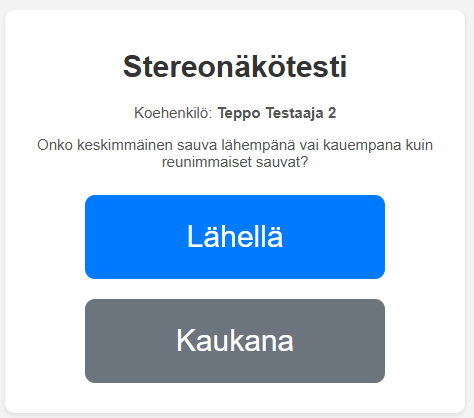

# Ihmisen syvyysnäön testauslaite

Testi perustuu klassiseen Howard-Dolman -testin periaatteeseen. Laitteessa on kolme pystysuoraa tolppaa (tai sauvaa) rivissä. Koehenkilö katsoo tolppia tietytä etäisyydeltä. Keskimmäistä tolppaa voidaan liikuttaa servo-ohjatusti eteen- tai taaksepäin suhteessa reunimmaisiin tolppiin. Koehenkilön tehtävä on arvioida, onko keskimmäinen tolppa lähempänä vai kauempana kuin reunimmaiset. Etäisyysero reunimmaisiin tolppiin pienenee testin edetessä, ja kun testattava on tehny kolme virhettä, on löydetty stereoerottelykyvyn raja.

Testilaite muodostaa WiFI-tukiaseman, johon liitytään kahdella laitteella: 1. Testaajan laite sekä 2. Testattavan pääte.
* Testaajan laitteessa syötetään testihenkilön nimi ja aloitetaan uusi testi, voi seurata testin etenemistä sekä kerätään tulokset. Tulokset voi ladata myös .csv-tiedostona
* Testattavan päätteessä (kännykkä on hyvä) on painikkeet, joilla arvio keskitolpan etäisyydestä tehdään (Lähellä/Kaukana)

## Käyttö:

Kun virrat on päällä, molemmilla laitteilla liitytään WiFiin "Stereovisiontest" (salasana: 12345678)

Testaaja menee selaimella osoitteeseen http://192.168.4.1/admin

Testattava menee selaimella osoitteeseen http://192.168.4.1/

Kansion admin.html ja subject.html ovat emulaattoreita, joilla voi kokeilla interaktiivisesti millaiset GUI:t ovat.

## Laitteisto:

* ESP32
* 9g servo
* Teräslanka (esim TIG-hitsauslankaa)
* 3D-tulostetut osat 
* [Onshape mallit](https://cad.onshape.com/documents/015ba60578bb0acbbb4cbba4/w/e4783b3f15ab7f564ce377d3/e/8b8e0c89aea4ec2eb4cf4481?renderMode=0&uiState=67ef9e59e533a868c3031aed)

# Stereonäkötestilaitteen katseluetäisyys

Jotta voidaan mitata stereonäön tarkkuutta noin 10 kaarisekunnin tasolle asti:
 
**Laitteiston parametrit:**
* Tolppien välinen sivuttaisetäisyys: n. 10 mm
* Keskimmäisen tolpan liikerata (syvyyssuunnassa): n. 18 mm ( ±9 mm keskikohdasta)

## Laskennan Perusteet

Stereonäön tarkkuus (η) kuvaa pienintä syvyyseroa, jonka henkilö pystyy havaitsemaan kahden eri etäisyydellä olevan kohteen välillä. Se ilmaistaan usein kulmayksiköissä (kaarisekunteina) ja riippuu silmien välisestä etäisyydestä (IPD), kohteiden välisestä fyysisestä syvyyserosta (Δd) ja katseluetäisyydestä (D).

**Kaava:**
Stereotarkkuus radiaaneina approksimoidaan kaavalla:

`η (rad) ≈ (IPD * Δd) / D²`

Missä:
* `η`: Stereotarkkuus radiaaneina
* `IPD`: Silmien välinen etäisyys (Interpupillary distance) metreinä
* `Δd`: Kohteiden välinen syvyysero metreinä
* `D`: Katseluetäisyys metreinä

## Parametrit ja Laskenta

Tavoitteena on laskea etäisyys `D`, jolla laitteen suurin mahdollinen syvyysero `Δd_max` tuottaa juuri 10 kaarisekunnin parallaksieron.

1.  **Tavoiteltu stereotarkkuus (η):**
    * `η = 10 kaarisekuntia`
    * Muunnos radiaaneiksi: `10" = (10 / 3600) * (π / 180) rad ≈ 4.848 * 10⁻⁵ rad`

2.  **Silmien välinen etäisyys (IPD):**
    * Käytetään yleistä keskiarvoa: `IPD ≈ 65 mm = 0.065 m`
    * *Huom: Tämä on oletus, todellinen IPD vaihtelee.*

3.  **Suurin syvyysero (Δd_max):**
    * Laitteen liikerata on 18 mm, joten suurin siirtymä keskikohdasta on puolet siitä.
    * `Δd_max = 18 mm / 2 = 9 mm = 0.009 m`

4.  **Katseluetäisyyden (D) ratkaiseminen:**
    * Muokataan kaavaa: `D² ≈ (IPD * Δd) / η`
    * `D ≈ √[ (IPD * Δd_max) / η ]`
    * Sijoitetaan arvot:
        `D ≈ √[ (0.065 m * 0.009 m) / (4.848 * 10⁻⁵ rad) ]`
        `D ≈ √[ 0.000585 m² / 4.848 * 10⁻⁵ ]`
        `D ≈ √[ 12.067 m² ]`
        `D ≈ 3.47 m`

Tällöin testilaitteen suositeltu katseluetäisyys on noin **3,5 metriä**.

Tällä etäisyydellä laitteen suurin fyysinen syvyyssiirtymä (9 mm) vastaa noin 10 kaarisekunnin stereotarkkuutta (olettaen 65 mm IPD). Tämä mahdollistaa testauksen tavoitellulla tarkkuustasolla laitteen mekaanisten rajoitusten puitteissa. Testiprotokollassa pyritään löytämään pienin havaittava siirtymä, mutta tämä laskettu etäisyys varmistaa, että 10 kaarisekunnin taso on saavutettavissa. Jos teet erikokoisen laitteen, etäisyys on toki eri.
